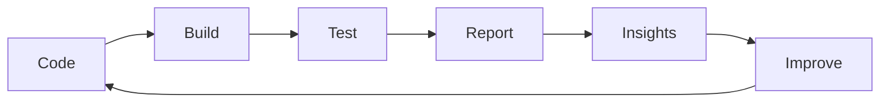

<!-- ========================= PROFILE README ========================= -->

<!-- 👋 Hello, I'm Daniyal Waris! QA Engineer ensuring delivery of high-reliability software and systems. -->

<h1 align="center">👋 Hi, I'm Daniyal Waris</h1>

<p align="center">
  <em><strong>QA Engineer | Automation Architect | ISTQB-Certified Test Specialist</strong></em><br/>
  🧪 Automated Testing • 🔍 Quality Assurance • 🔄 CI/CD Pipelines • 📊 Observability & Reliability
</p>

<p align="center">
  
  
  
</p>

---

## 🚀 About Me

Hi there! I'm Daniyal — a **quality-obsessed engineer** focused on building reliable systems before they reach production.
From exploratory testing to automation architecture, I work on making software **stable, scalable, and release-ready**.

### 🔑 Highlights

* 🏅 ISTQB Certified (CTFL) with 6+ years in QA, automation & integration
* 🛠️ Built and improved automation frameworks for web, mobile, desktop, and embedded platforms
* 💡 Passionate about CI/CD, observability, and improving quality upstream
* 🤝 Strong believer in connecting **QA, Dev, and DevOps** into one quality system

---

## ⚙️ Philosophy

```text
Quality is not a phase.
Quality is a system.

If testing is slow → feedback loops are broken.
If bugs escape → observability is missing.
If releases fail → automation is insufficient.
```

---

## 💼 What I Do

🧪 **Building high-coverage test suites** | 🤝 **Aligning QA with DevOps pipelines** | 📊 **Enabling stable, high-confidence releases** | ✨ **Driving quality through test strategy and automation**


<table>
  <tr>
    <td align="center" width="320" height="220">
      <br>
      <strong>Test Automation & Framework Design</strong><br><br>
      <div align="left">
        📌 Designed and maintained scalable automation frameworks<br>
        📌 Enabled cross-browser and cross-platform testing<br>
        📌 Integrated UI/API tests in CI pipelines<br>
        📌 Increased regression coverage and test reliability
      </div>
    </td>
    <td align="center" width="320" height="220">
      <br>
      <strong>Manual & Exploratory Testing</strong><br><br>
      <div align="left">
        🔍 Planned and executed test cycles across web, mobile, and hardware<br>
        🧭 Led UAT and exploratory testing aligned with business goals<br>
        📝 Created and maintained test cases, checklists, and traceability<br>
        🧠 Contributed to sprint planning, QA sign-offs, and agile QA ownership
      </div>
    </td>
    <td align="center" width="320" height="220">
      <br>
      <strong>CI/CD & DevOps Integration</strong><br><br>
      <div align="left">
        🔄 Embedded automated tests into build pipelines<br>
        📈 Set up test result reporting and dashboarding<br>
        🛠️ Collaborated on test environment setup & maintenance<br>
        ⏱️ Implemented test parallelisation to reduce feedback loops
      </div>
    </td>
  </tr>
  <tr>
    <td align="center" width="320" height="220">
      <br>
      <strong>API & Integration Validation</strong><br><br>
      <div align="left">
        🔗 Validated REST endpoints end-to-end<br>
        ⚙️ Verified integration between microservices and external systems<br>
        🧾 Conducted contract and schema-based testing<br>
        🚦 Simulated dependent services using mocks/stubs
      </div>
    </td>
    <td align="center" width="320" height="220">
      <br>
      <strong>Quality Monitoring & Reporting</strong><br><br>
      <div align="left">
        📊 Monitored release readiness and defect trends<br>
        🧩 Collaborated in triage and root cause analysis<br>
        📋 Shared test status and release health with stakeholders<br>
        📂 Maintained test documentation and traceability
      </div>
    </td>
    <td align="center" width="320" height="220">
      <br>
      <strong>Performance & Security Awareness</strong><br><br>
      <div align="left">
        🚀 Executed performance testing to benchmark scalability<br>
        🔐 Participated in security-focused test cycles<br>
        🧯 Reported vulnerabilities and system bottlenecks<br>
        🧪 Ran stress/load test scenarios under peak usage
      </div>
    </td>
  </tr>
</table>

---

## 🧠 System Thinking



> A test is valuable only if it improves the system.

---

## 🛠️ Tech Stack

### 🧪 Frameworks & Tools


### 💻 Languages


### 🔄 CI/CD & Version Control


### ☁️ Cloud Platforms


### 📈 Monitoring & Reporting


### 📋 QA Tools & Test Reporting


---
## 🏆 Certifications

<table>
  <thead>
    <tr>
      <th>Category</th>
      <th>Certifications</th>
    </tr>
  </thead>
  <tbody>
    <tr>
      <td><strong>Foundational QA</strong></td>
      <td>
        • Certified Tester Foundation Level (CTFL)<br>
        • Become a Software Tester<br>
        • Test Automation Foundations<br>
        • Programming Foundations: Software Testing/QA<br>
        • Behavior-Driven Development
      </td>
    </tr>
    <tr>
      <td><strong>Test Automation & Tools</strong></td>
      <td>
        • Become a Test Automation Engineer<br>
        • Selenium WebDriver with C#<br>
        • Learning Selenium<br>
        • Java: Testing with JUnit<br>
        • JMeter: Performance and Load Testing<br>
        • API Test Automation with SoapUI<br>
        • Scripting for Testers
      </td>
    </tr>
    <tr>
      <td><strong>Agile & Project QA</strong></td>
      <td>
        • Scrum Fundamentals Certified (SFC)<br>
        • Scrums for Professional<br>
        • Agile Foundations / Agile Testing / Scrum: The Basics<br>
        • Project Management Foundations: Quality
      </td>
    </tr>
    <tr>
      <td><strong>DevOps & Cloud</strong></td>
      <td>
        • Introduction to Kubernetes (LFS158)
      </td>
    </tr>
  </tbody>
</table>
---

## 🚀 What Sets Me Apart

Most QA focuses on:

* writing test cases
* increasing coverage
* validating features late in the cycle

I focus on:

* reducing **feedback time**
* improving **system reliability**
* building **testable architectures**
* pushing quality earlier into the development lifecycle

---

## 🔬 Current Focus

* Scaling automation for complex systems
* Improving CI pipeline speed and stability
* Bringing observability into QA workflows
* Exploring AI-assisted testing and smarter quality signals

---

## 🚀 Repository Topics Highlights

<p align="left">
  
  
  
  
  
</p>

---

## 🤝 Let’s Collaborate

<p align="center">
  <a href="https://linkedin.com/in/daniyalwaris" target="_blank">
    
  </a>
  &nbsp;&nbsp;&nbsp;
  <a href="mailto:daniyalwaris92@gmail.com">
    
  </a>
</p>

<p align="center">
  💬 <strong>Let’s talk about testing, automation, CI/CD, and building reliable systems.</strong>
</p>

---

<p align="center">
  <em>“Good QA finds bugs. Great QA prevents them.”</em>
</p>
