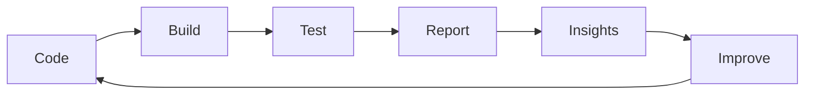

<!-- ========================= PROFILE README ========================= -->

<!-- 👋 Hello, I'm Daniyal Waris! QA Engineer ensuring delivery of high-reliability software and systems. -->

<h1 align="center">👋 Hi, I'm Daniyal Waris</h1>

<p align="center">
  <em><strong>QA Engineer | Automation Architect | ISTQB-Certified Test Specialist</strong></em><br/>
  🧪 Automated Testing • 🔍 Quality Assurance • 🔄 CI/CD Pipelines • 📊 Observability & Reliability
</p>

<p align="center">
  
  
  
</p>

---

## 🚀 About Me

Hi there! I'm Daniyal — a **quality-obsessed engineer** focused on building reliable systems before they reach production.
From exploratory testing to automation architecture, I work on making software **stable, scalable, and release-ready**.

### 🔑 Highlights

* 🏅 ISTQB Certified (CTFL) with 6+ years in QA, automation & integration
* 🛠️ Built and improved automation frameworks for web, mobile, desktop, and embedded platforms
* 💡 Passionate about CI/CD, observability, and improving quality upstream
* 🤝 Strong believer in connecting **QA, Dev, and DevOps** into one quality system

---

## ⚙️ Philosophy

```text
Quality is not a phase.
Quality is a system.

If testing is slow → feedback loops are broken.
If bugs escape → observability is missing.
If releases fail → automation is insufficient.
```

---

## 💼 What I Do

🧪 **Building high-coverage test suites** | 🤝 **Aligning QA with DevOps pipelines** | 📊 **Enabling stable, high-confidence releases** | ✨ **Driving quality through test strategy and automation**

---

### 🧪 Test Automation & Framework Design

📌 Designed and maintained scalable automation frameworks
📌 Enabled cross-browser and cross-platform testing
📌 Integrated UI/API tests in CI pipelines
📌 Increased regression coverage and test reliability

### 🔍 Manual & Exploratory Testing

🔍 Planned and executed test cycles across web, mobile, and hardware
🧭 Led UAT and exploratory testing aligned with business goals
📝 Created and maintained test cases, checklists, and traceability
🧠 Contributed to sprint planning, QA sign-offs, and agile QA ownership

### 🔄 CI/CD & DevOps Integration

🔄 Embedded automated tests into build pipelines
📈 Set up test result reporting and dashboarding
🛠️ Collaborated on test environment setup & maintenance
⏱️ Implemented test parallelization to reduce feedback loops

### 🔗 API & Integration Validation

🔗 Validated REST endpoints end-to-end
⚙️ Verified integration between microservices and external systems
🧾 Conducted contract and schema-based testing
🚦 Simulated dependent services using mocks/stubs

### 📊 Quality Monitoring & Reporting

📊 Monitored release readiness and defect trends
🧩 Collaborated in triage and root cause analysis
📋 Shared test status and release health with stakeholders
📂 Maintained test documentation and traceability

### 🚀 Performance & Security Awareness

🚀 Executed performance testing to benchmark scalability
🔐 Participated in security-focused test cycles
🧯 Reported vulnerabilities and system bottlenecks
🧪 Ran stress/load test scenarios under peak usage

---

## 🧠 System Thinking



> A test is valuable only if it improves the system.

---

## 🛠️ Tech Stack

### 🧪 Frameworks & Tools


### 💻 Languages


### 🔄 CI/CD & DevOps


### ☁️ Cloud


### 📊 Monitoring & Observability


---

## 🏆 Certifications

<p align="center">
  
  
  
  
</p>

### 🎯 Foundational QA

* Certified Tester Foundation Level (CTFL)
* Become a Software Tester
* Test Automation Foundations
* Programming Foundations: Software Testing / QA
* Behavior-Driven Development

### 🤖 Test Automation & Tools

* Become a Test Automation Engineer
* Selenium WebDriver with C#
* Learning Selenium
* Java: Testing with JUnit
* JMeter: Performance and Load Testing
* API Test Automation with SoapUI
* Scripting for Testers

### 🔄 Agile & Project QA

* Scrum Fundamentals Certified (SFC)
* Scrum for Professionals
* Agile Foundations / Agile Testing / Scrum: The Basics
* Project Management Foundations: Quality

### ☁️ DevOps & Cloud

* Introduction to Kubernetes (LFS158)

> Continuous learning is part of how I build better quality systems.

---

## 🚀 What Sets Me Apart

Most QA focuses on:

* writing test cases
* increasing coverage
* validating features late in the cycle

I focus on:

* reducing **feedback time**
* improving **system reliability**
* building **testable architectures**
* pushing quality earlier into the development lifecycle

---

## 🔬 Current Focus

* Scaling automation for complex systems
* Improving CI pipeline speed and stability
* Bringing observability into QA workflows
* Exploring AI-assisted testing and smarter quality signals

---

## 🚀 Repository Topics Highlights

<p align="left">
  
  
  
  
  
</p>

---

## 🤝 Let’s Collaborate

<p align="center">
  <a href="https://linkedin.com/in/daniyalwaris" target="_blank">
    
  </a>
  &nbsp;&nbsp;&nbsp;
  <a href="mailto:daniyalwaris92@gmail.com">
    
  </a>
</p>

<p align="center">
  💬 <strong>Let’s talk about testing, automation, CI/CD, and building reliable systems.</strong>
</p>

---

<p align="center">
  <em>“Good QA finds bugs. Great QA prevents them.”</em>
</p>
